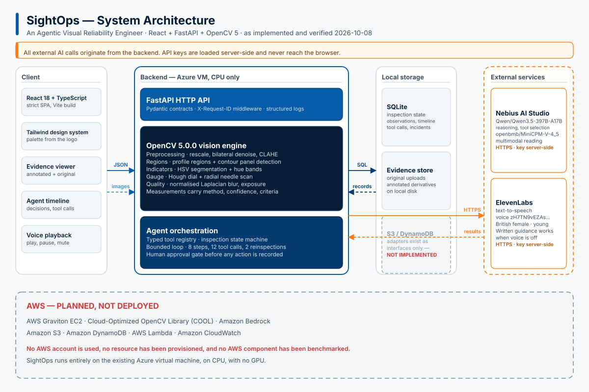
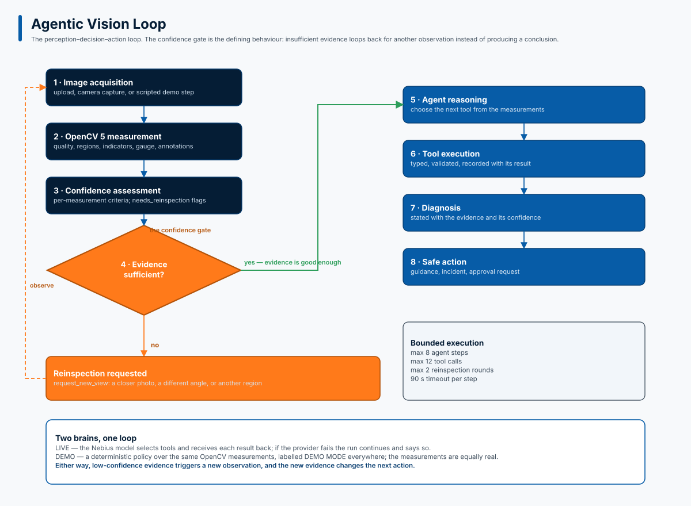
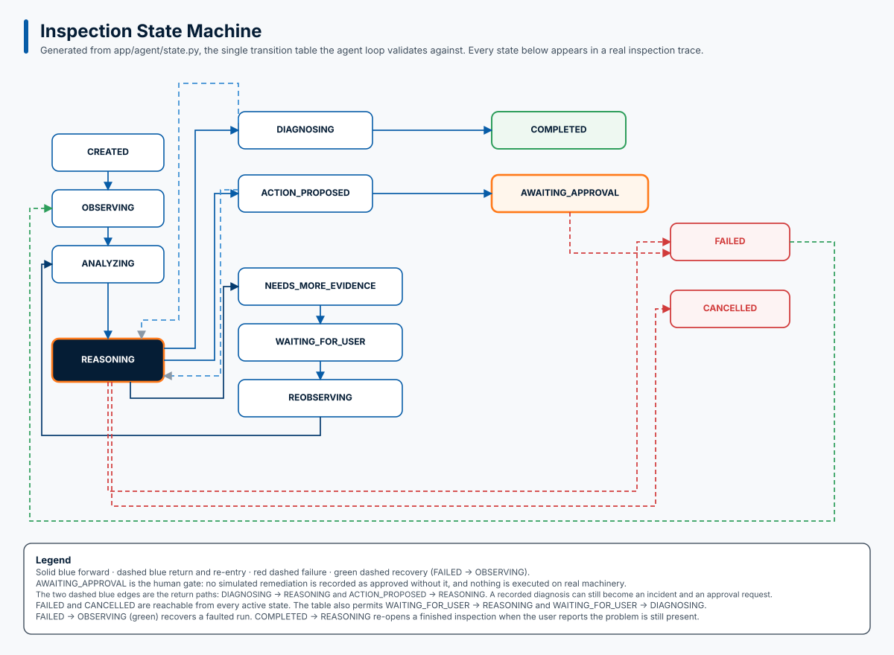
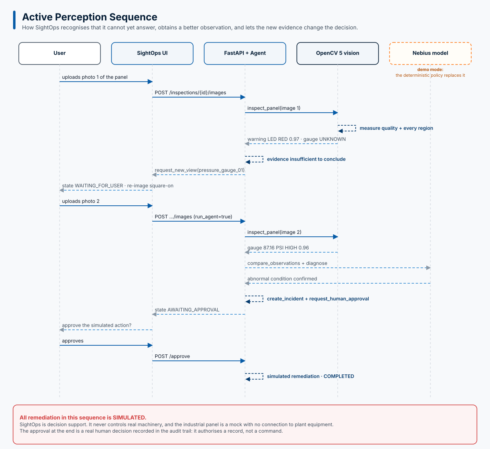
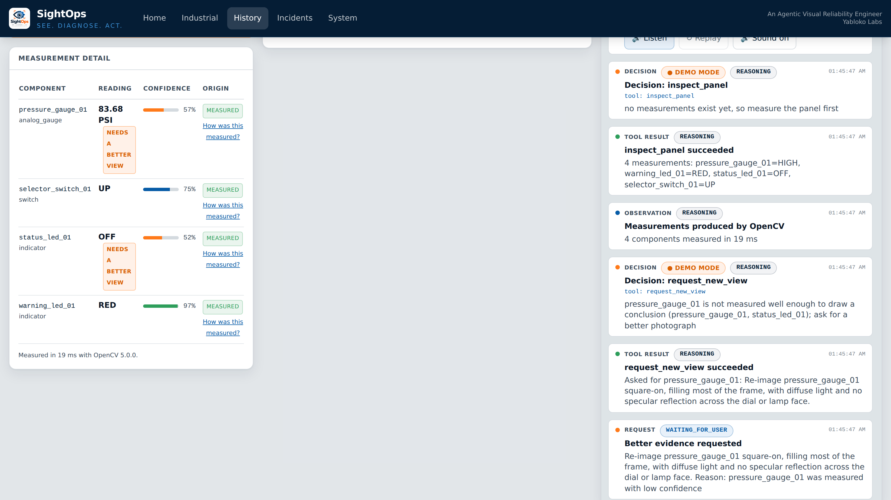
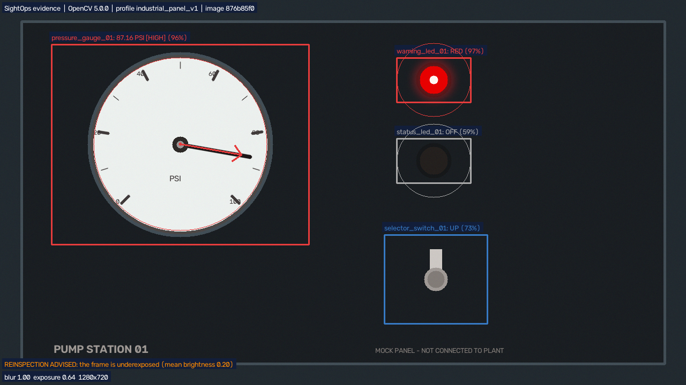
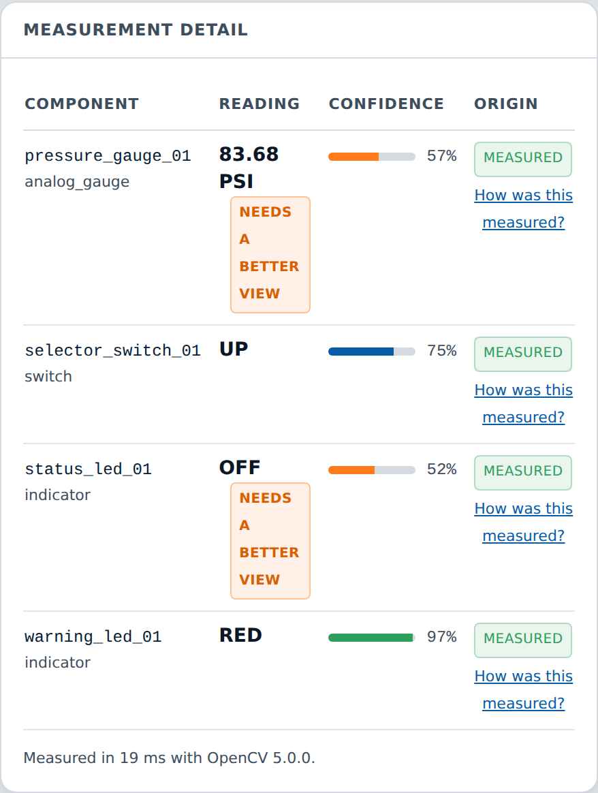
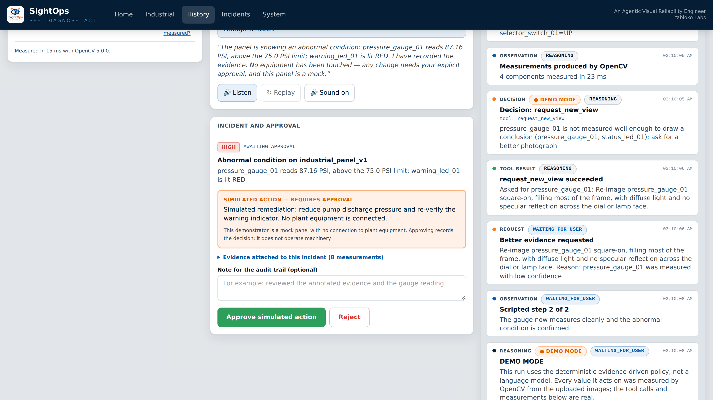
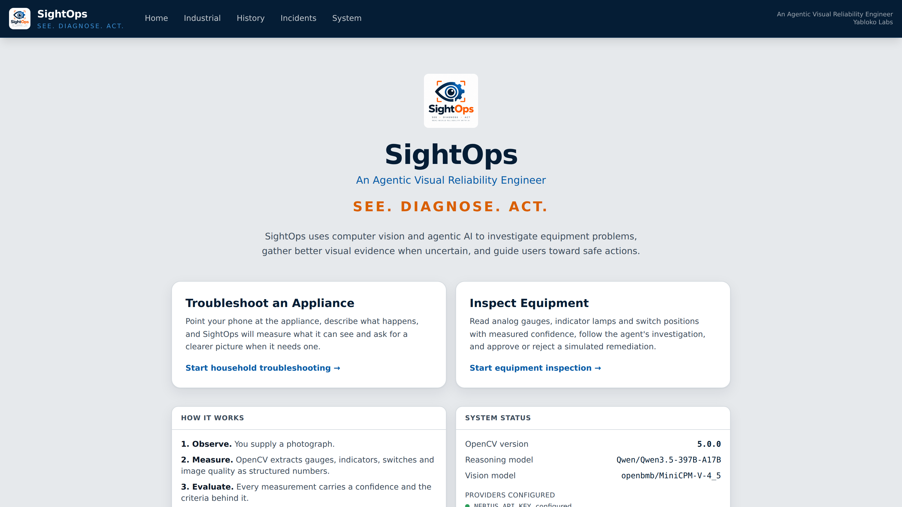
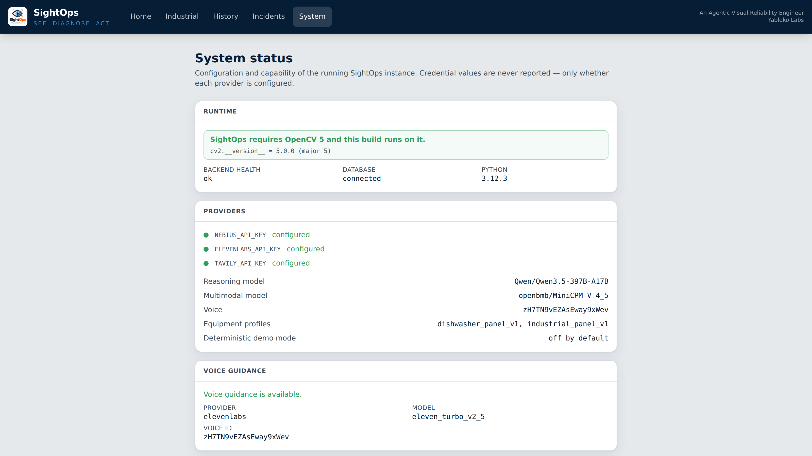

# SightOps — An Agentic Visual Reliability Engineer

**See. Diagnose. Act.**

SightOps is an AI-powered visual troubleshooting assistant for household appliances
and industrial equipment. You give it a photograph of a machine. It measures what the
image actually shows with OpenCV 5, reasons about what it can and cannot see, decides
whether it needs a better look, asks for one, and measures again.

The defining behaviour is not recognising an appliance. It is knowing **what can be
observed, what remains uncertain, what needs to be inspected next, and when enough
evidence exists to act** — and when to stop and ask a person.

- Organization: **Yabloko Labs**
- Competition: **OpenCV AI Competition 2026, powered by AWS**
- Deployment: an existing Azure virtual machine, CPU-only
- AWS integration: **NOT IMPLEMENTED** (see [Limitations](#limitations))

---

## Contents

- [The idea](#the-idea)
- [What it actually does](#what-it-actually-does)
- [Architecture](#architecture)
- [Active perception, step by step](#active-perception-step-by-step)
- [OpenCV 5 operations](#opencv-5-operations)
- [Evidence](#evidence)
- [Evaluation](#evaluation)
- [Quick start](#quick-start)
- [API surface](#api-surface)
- [Safety](#safety)
- [Repository layout](#repository-layout)
- [Demo video](#demo-video)
- [Limitations](#limitations)

---

## The idea

It started with a phone call about a broken dishwasher. A photograph of a control
panel is easy to take and hard to read from a distance: the person on the other end
of the call could not tell which light was on, or what the dial was pointing at.

SightOps is the assistant that could have helped in that moment. A tool that takes
the photograph, measures it properly, says what it can see, admits what it cannot,
and tells you what to photograph next.

## What it actually does

Given a photograph of a panel, SightOps:

1. **Observes** — loads the image, scores its quality, detects and corrects panel
   perspective.
2. **Measures** — reads analog gauges, indicator lamps, switches and displays with
   real OpenCV operations, and attaches a confidence and a provenance to every value.
3. **Reasons** — checks whether the measurements are good enough to support a
   conclusion.
4. **Investigates** — when they are not, requests a specific new view
   (*"re-image pressure_gauge_01 square-on, filling most of the frame, with diffuse
   light and no specular reflection across the dial"*) and pauses.
5. **Decides** — with a better image, diffs the two observations, records a
   diagnosis, raises an incident.
6. **Acts** — proposes a remediation and **stops for human approval**. Nothing
   executes without a person.

Every step is a typed tool call, recorded in an auditable trace.

## Architecture



The vision engine, the agent loop, the model providers, the voice provider and the
storage layer sit behind explicit interfaces, so a different provider or a different
storage backend is a substitution rather than a rewrite. The design notes for the
AWS-shaped version of each seam are in [`docs/architecture/aws.md`](docs/architecture/aws.md)
— that document is a plan, not a claim of deployment.



The inspection state machine is a single explicit transition table, and the loop is
bounded: 8 steps, 12 tool calls, 2 reinspection rounds and a 90-second per-step
timeout. A run cannot spin.



## Active perception, step by step

This is the real trace produced by the industrial demonstration, not a script of
expected output.



| # | Observation | What was measured | What the agent did |
|---|---|---|---|
| 1 | Angled frame with glare across the dial | Gauge `83.68 PSI` at confidence **0.567**; warning lamp `RED`; two of four components below the floor | `inspect_panel` → `request_new_view` (reason: *"pressure_gauge_01 was measured with low confidence"*) → state `WAITING_FOR_USER` |
| 2 | Clean, square-on frame | Gauge `87.16 PSI` at confidence **0.959**, state `HIGH`, above the 75 PSI limit; lamp `RED` | `inspect_panel` → `compare_observations` → `record_diagnosis` → `create_incident` → `request_human_approval` → state `AWAITING_APPROVAL` |
| — | Human decision | — | Approved → `COMPLETED`, incident resolved |

Two things are worth noting. The agent published the first reading *and still refused
to conclude from it* — low confidence is reported rather than hidden. And the second
observation is what makes the diagnosis possible: the loop is closed by new evidence,
not by a retry.

## OpenCV 5 operations

Verified: `cv2.__version__ == "5.0.0"` (OpenCV **5.0.0**, `opencv-python==5.0.0.93`).
Every measurement below is a real pixel operation; none of it is decorative.

| Module | Operation |
|---|---|
| `preprocess.py` | rescale, gray/alpha normalisation, bilateral denoise, CLAHE, ROI crop, perspective detection and homography rectification |
| `quality.py` | normalised Laplacian-variance blur score, exposure quality from clipping fractions and mean luma, resolution sufficiency |
| `regions.py` | panel detection by contour rectangularity |
| `gauges.py` | Hough dial localisation, radial scan over the 0.28R–0.72R band, dual-polarity peak search, sub-step parabolic refinement, **needle shape validation** |
| `indicators.py` | HSV lamp segmentation with contour selection and hue-band classification; switch orientation by PCA on the lever blob; display lit/blank from stroke level |
| `change.py` | structured measurement diff plus a pixel-difference metric |
| `annotate.py` | evidence overlays drawn from the same numbers the agent used |

A gauge reading is published only if the needle covers at least 60% of the sampled
ray, the angular peak is narrower than 14°, and confidence clears 0.50. Otherwise the
state is `UNKNOWN` and **no number is reported**. A confident wrong pressure reading
is worse than no reading at all.

## Evidence

The agent's conclusion is traceable to an annotated image you can open and check.

| The workspace, first observation (low confidence) | Annotated evidence, second observation |
|---|---|
|  |  |

| Measurement detail | Awaiting human approval |
|---|---|
|  |  |

| Landing | System status |
|---|---|
|  |  |

All screenshots in `demo/screenshots/` are captured from the running application by
`demo/videowright/scripts/capture_app_screens.mjs` — they cannot drift from what the
app renders.

## Evaluation

Generated by `backend/scripts/evaluate.py` on a synthetic fixture set whose ground
truth is exact (the fixture drew the values). The full table, including every
misclassification, is in [`docs/evaluation/results.md`](docs/evaluation/results.md).

| Metric | Value |
|---|---|
| Analog gauge attempts / published / refused | 136 / 112 / 24 |
| Gauge mean absolute error | **0.4724 PSI** (median 0.185, p95 1.54, max 3.32) |
| **Wrong-value escape rate** | **0.9%** (1 of 112) |
| Indicator macro precision / recall | 0.9861 / 0.9853 |
| Display lit/blank accuracy | 79.4% (27/34) |
| Switch position accuracy | 100% (17/17) |
| ROI localisation | 100% (136/136) |
| Agent task success | 4/4 |
| Active-perception precision / recall | 1.0 / 1.0 |
| Vision analysis latency | 9.67 ms mean, 23.27 ms max per 1280×720 frame |

The single wrong-value escape is reported in full: on a `perspective`-distorted frame
the gauge read `46.82` against a true `43.5` at 0.796 confidence. It is one reading,
it is measured against exact ground truth, and it is the number this project treats as
the one that must reach zero.

The quality gate's detection rate is 42.9% against an *assumed* unreadable set, while
the false-refusal rate on readable frames is 1.2%. Several frames that analysis calls
unreadable are in fact measurable — which is exactly why the published wrong-value
escape rate is the figure to trust rather than the readability assumption.

## Quick start

### Docker (only Docker required)

```bash
docker compose up --build
# open http://localhost:8080
```

Two services on one network: the OpenCV 5 backend, and the nginx-served web client
which proxies `/api` and `/health` to it. Provider keys are optional and passed
through from the host environment:

```bash
export NEBIUS_API_KEY=... ELEVENLABS_API_KEY=... TAVILY_API_KEY=...
docker compose up --build
```

Without `NEBIUS_API_KEY` the agent runs the deterministic policy instead of model
reasoning, and everything else still works. No key is stored in the repository or
baked into an image.

### Local development

```bash
cd backend && python3 -m venv ../.venv && ../.venv/bin/pip install -e .
../.venv/bin/python -m uvicorn app.main:app --host 127.0.0.1 --port 8000

cd frontend && npm install && npm run dev   # http://localhost:5173
```

### Tests

```bash
cd backend && ../.venv/bin/python -m pytest -q          # 165 tests
cd frontend && npm run typecheck && npm run build
cd backend && ../.venv/bin/python scripts/evaluate.py --out ../docs/evaluation
cd backend && ../.venv/bin/python scripts/verify_demo_scenarios.py
cd backend && ../.venv/bin/python scripts/check_providers.py
```

## API surface

| Method | Path | Purpose |
|---|---|---|
| `GET` | `/health` | liveness plus database and OpenCV version (200 with `status: degraded` when the database is down) |
| `GET` | `/api/system/status` | capability report: OpenCV version, provider presence, model names, `aws_integration: "NOT IMPLEMENTED"` |
| `POST` | `/api/inspections` | open an inspection |
| `POST` | `/api/inspections/{id}/images` | upload a photograph (validated type and size) |
| `POST` | `/api/inspections/{id}/analyze` | run the vision engine |
| `POST` | `/api/inspections/{id}/messages` | continue the conversation |
| `GET` | `/api/inspections/{id}/observations` | every analysed frame with its measurements |
| `GET` | `/api/inspections/{id}/timeline` | the agent's reasoning, decisions and tool results |
| `GET` | `/api/inspections/{id}/tool-calls` | the typed tool-call trace |
| `GET` | `/api/inspections/{id}/evidence/{image_id}` | the frame, `?annotated=true` for the overlay |
| `POST` | `/api/inspections/{id}/approve` \| `/reject` | the human decision gate |
| `GET` | `/api/demo/flows`, `POST /api/demo/{flow}`, `POST /api/demo/{id}/next-observation` | the two scripted demonstrations |

## Safety

SightOps is a decision-support system, not a controller.

- Consequential actions **require explicit human approval**; the state machine has no
  path that executes one.
- The competition shutdown demonstration is **simulated**, and the interface says so
  on the panel itself.
- No safety interlock is ever bypassed, and unsafe electrical repair is never
  suggested.
- Uncertainty is represented explicitly: below the reporting floor a value is
  withheld and the reason is recorded.
- Uploads are validated, and inspection and action traces are kept for audit.

## Repository layout

```
backend/            FastAPI service, OpenCV 5 vision engine, agent loop, SQLite store
  app/vision/       preprocessing, quality, regions, gauges, indicators, change, annotate
  app/agent/        typed tools, deterministic policy, state machine, bounded loop
  app/api/          HTTP surface
  scripts/          evaluate.py, verify_demo_scenarios.py, check_providers.py,
                    calibrate_quality.py, bench_cool.py
  tests/            165 tests
frontend/           React + TypeScript + Tailwind client (Vite)
demo/               VideoWright project, captured screenshots, narration, rendered video
docs/               evaluation, architecture, benchmarks, competition notes, diagrams
```

## Demo video

A 4-minute walkthrough with narration: [`demo/videos/sightops-demo.mp4`](demo/videos/sightops-demo.mp4).
It is built from real application recordings by the VideoWright project in
`demo/videowright/`; see [`demo/README.md`](demo/README.md) for how it is produced,
which voice was used, and which parts are simulated.

## Limitations

Stated plainly, because a reliability tool that overstates itself is not useful.

- **AWS integration is NOT IMPLEMENTED.** No AWS resource has been created, and no
  AWS credential is required to run anything here. Amazon Bedrock, S3, DynamoDB,
  Lambda, CloudWatch and Cloud-Optimized OpenCV on Graviton are **designed, not
  deployed and not benchmarked**; `docs/architecture/aws.md` is a plan.
  `backend/scripts/bench_cool.py` exists and has been smoke-tested only as an
  x86-64 measurement of this development machine, which is not a COOL result.
- **Display reading is the weakest vision class** — 79.4% lit/blank accuracy. A
  seven-segment value is not decoded by the vision engine at all; that is left to the
  multimodal model and tagged `inferred`.
- **Regions are calibrated per equipment profile**, marked `source: "configured"`.
  Automatic panel detection exists but does not identify which component is which on
  an unseen panel.
- **The fixtures are synthetic.** They are generated with exact ground truth, which
  makes the accuracy numbers meaningful, but they are not photographs of real
  machines.
- **Tool-failure recovery could not be measured** by the evaluation harness: no
  scenario in the suite forces a tool to fail.
- The competition skill set named in the project brief (`ponytail`, `headroom`,
  `diagram-design`, `nori`, `senior-swe`, `full-send`, `adhd`) is not installed in
  this environment. Serena, novgraph, Tavily and Hindsight were used instead.

---

Yabloko Labs · OpenCV AI Competition 2026
