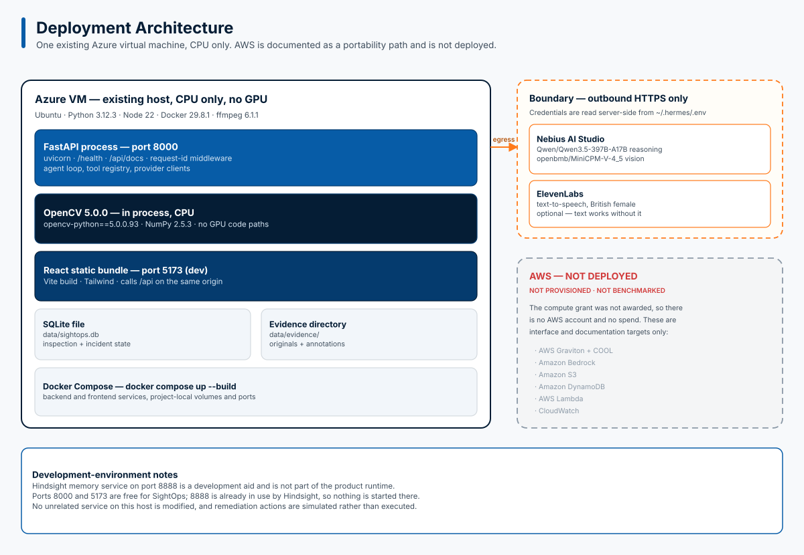

# SightOps — Complete Product Build Specification

> **Project:** SightOps  
> **Tagline:** An Agentic Visual Reliability Engineer  
> **Brand:** See. Diagnose. Act.  
> **Organization:** Yabloko Labs  
> **Competition:** OpenCV AI Competition 2026, powered by AWS  
> **Repository:** `sightops`  
> **Workspace:** `/home/azureuser/sightops`  
> **Execution mode:** FULL SEND

---

## 1. Mission

Build **SightOps**, a complete AI-powered visual troubleshooting platform that helps people investigate problems with household appliances and industrial equipment.

SightOps must do more than identify objects or describe photographs.

It must behave like an experienced troubleshooter:

1. Observe the equipment.
2. Extract measurable visual evidence.
3. Evaluate evidence quality and uncertainty.
4. Form or revise diagnostic hypotheses.
5. Decide what additional information is needed.
6. Request another image or invoke another vision tool.
7. Reinspect the equipment.
8. Determine an appropriate next action.
9. Guide the user or initiate a controlled workflow.
10. Verify the outcome when possible.

The defining loop is:

```text
SEE
 ↓
MEASURE
 ↓
REASON
 ↓
INVESTIGATE
 ↓
DECIDE
 ↓
ACT
 ↓
OBSERVE AGAIN
```

The system must implement a genuine **perception-decision-action loop**.

A single image sent to a vision-language model followed by a generic answer is not sufficient.

### Primary objectives

- Build a functioning application, not a mockup.
- Use OpenCV 5 for substantive computer-vision processing.
- Implement real agentic tool orchestration.
- Support household appliance troubleshooting.
- Support industrial equipment inspection.
- Provide confidence-aware active perception.
- Integrate Nebius AI for reasoning.
- Integrate ElevenLabs for voice guidance.
- Build an accessible, polished interface.
- Produce reproducible tests and evaluation results.
- Prepare AWS Graviton and COOL integration.
- Create a professional demonstration video.
- Publish the implementation to GitHub.

Follow `AGENTS.md` throughout development.

---

## 2. Project Background

### The original inspiration

SightOps originated from a real experience.

The founder lives approximately one hour away from his parents.

One day, his mother called because their dishwasher was not working.

Since he could not immediately visit, he asked her to send photographs of the dishwasher.

He examined the control panel, requested additional photographs, asked her to check specific things, and gradually helped resolve the issue.

The troubleshooting process followed this pattern:

```text
Observe the problem
        ↓
Inspect the available image
        ↓
Form a hypothesis
        ↓
Identify missing evidence
        ↓
Request another view
        ↓
Inspect the new evidence
        ↓
Recommend the next action
```

This inspired a question:

**Why couldn't an AI agent perform the same investigation?**

Imagine someone pointing their phone at a malfunctioning dishwasher and saying:

> "It's not working. Can you help me figure out why?"

SightOps should inspect the visible evidence, ask intelligent follow-up questions, request better images when necessary, and guide the user through safe troubleshooting.

### Who benefits?

**Household users**

- Elderly people living away from their children.
- People unfamiliar with appliance troubleshooting.
- Individuals without immediate access to technical help.
- People who want quick, guided diagnosis.

**Professional users**

- Junior technicians.
- Field engineers.
- Maintenance workers.
- Facility operators.
- Industrial inspection teams.
- Data-center technicians.

The common problem:

> The equipment is physically in front of someone, but the expertise needed to understand it is somewhere else.

SightOps aims to make that expertise available through a camera.

---

## 3. Product Scope

Build one application with two operating modes.

### Mode A: Home Troubleshooting

Designed for nontechnical users.

The interface should prioritize simplicity, accessibility, and clear guidance.

Example scenarios:

- Dishwasher not working.
- Washing machine showing an error.
- Air-conditioner warning indicator.
- Water purifier status problem.
- Refrigerator display warning.
- Generic appliance control-panel issue.

The initial release must include at least one fully functioning dishwasher troubleshooting scenario.

Other appliance categories can use generalized inspection capabilities, provided the limitations are clearly communicated.

### Mode B: Industrial Inspection

Designed for equipment inspection and maintenance.

Initial supported visual components:

- Analog gauges.
- Status LEDs.
- Warning indicators.
- Switch positions.
- Equipment panels.
- Visible changes between inspections.

The initial industrial demonstrator must include a mock control panel with reproducible fault scenarios.

Both modes must share the same underlying vision, agent, storage, and workflow components.

---

## 4. User Experience

### 4.1 Landing page

Create a polished landing page using the supplied SightOps branding.

Primary headline:

**SightOps**

Supporting headline:

**An Agentic Visual Reliability Engineer**

Brand statement:

**See. Diagnose. Act.**

Suggested description:

> SightOps uses computer vision and agentic AI to investigate equipment problems, gather better visual evidence when uncertain, and guide users toward safe actions.

Primary actions:

- Troubleshoot an Appliance
- Inspect Equipment

The page should communicate what SightOps does immediately.

Avoid excessive marketing copy.

### 4.2 Home troubleshooting flow

The user should be able to:

1. Select Home Troubleshooting.
2. Upload an image or capture one using a camera.
3. Describe the issue using text.
4. Optionally use voice input if implemented.
5. Start an inspection.
6. View the image and detected components.
7. Read or listen to the agent's findings.
8. Respond to follow-up questions.
9. Upload another image without restarting the session.
10. Receive suggested next steps.
11. Confirm whether the issue was resolved.

Example:

**User:**

> My dishwasher isn't working.

**SightOps:**

> I can see the control panel, but the display is difficult to read. Could you take another photo a little closer?

**User uploads another image.**

**SightOps:**

> I can now see the display more clearly. Let's check the door and the visible status indicators before deciding what to try next.

The exact diagnosis must depend on actual evidence.

Do not invent appliance error codes or manufacturer-specific instructions.

### 4.3 Industrial inspection flow

The user should be able to:

1. Select Industrial Inspection.
2. Upload or capture an equipment image.
3. Run visual analysis.
4. Inspect OpenCV annotations.
5. Review gauge readings and indicator states.
6. View measurement confidence.
7. See agent reasoning and tool calls.
8. Follow reinspection requests.
9. Review incident creation.
10. Approve or reject simulated remediation.

### 4.4 Inspection workspace

Create a distinctive inspection interface.

Suggested desktop layout:

```text
┌─────────────────────────────────────────────────────────────┐
│ SightOps                            Home | Industrial       │
├───────────────────┬─────────────────────┬───────────────────┤
│                   │                     │                   │
│ CAMERA / IMAGE    │ VISUAL EVIDENCE     │ AGENT TIMELINE    │
│                   │                     │                   │
│ Original frame    │ Detected regions    │ Observation       │
│                   │                     │                   │
│ Upload / capture  │ Gauge measurements  │ Reasoning         │
│                   │                     │                   │
│ Camera controls   │ LED states          │ Tool calls        │
│                   │                     │                   │
│                   │ Confidence          │ Next action       │
│                   │                     │                   │
├───────────────────┴─────────────────────┴───────────────────┤
│ Ask SightOps...                                Send         │
└─────────────────────────────────────────────────────────────┘
```

On mobile, convert this into a responsive stacked layout.

### 4.5 Accessibility

Prioritize:

- Readable typography.
- High contrast.
- Large controls.
- Keyboard navigation.
- Clear error messages.
- Voice playback.
- Simple language in Home mode.
- Responsive layouts.
- Visible progress states.
- Accessible image-upload controls.

Avoid unnecessary technical jargon for household users.

---

## 5. Computer Vision Architecture

### 5.1 OpenCV 5 requirement

The application must execute genuine OpenCV 5 image-processing operations.

OpenCV must not merely load an image before forwarding it to a multimodal model.

Verify the installed version at runtime.

Record the version in diagnostic output and evaluation reports.

If OpenCV 5 requires a source build, document and automate that process.

Do not silently substitute OpenCV 4.

### 5.2 Image ingestion

Support:

- JPEG.
- PNG.
- WebP where supported.
- Webcam frames.
- Mobile camera capture through the browser.

Validate:

- File type.
- File size.
- Image dimensions.
- Decode success.
- Resource limits.

Generate stable image identifiers.

Store original evidence separately from annotated derivatives.

### 5.3 Image preprocessing

Implement relevant OpenCV operations:

- Image resizing.
- Denoising.
- Color-space conversion.
- Contrast adjustment.
- Perspective transformation.
- Region cropping.
- Geometric normalization.

Avoid destructive preprocessing that removes important evidence.

Preserve the original image.

### 5.4 Region-of-interest detection

Identify and isolate relevant regions such as:

- Control panels.
- Indicator lights.
- Gauges.
- Switches.
- Displays.

For the initial demonstrator, calibrated or configured equipment regions are acceptable.

Document which regions are configured and which are detected automatically.

### 5.5 LED and indicator analysis

Implement indicator-state detection using appropriate OpenCV techniques.

Possible methods:

- HSV color segmentation.
- Lab color analysis.
- Thresholding.
- Morphological filtering.
- Contour analysis.
- ROI intensity statistics.

Return structured results.

Example:

```json
{
  "component_id": "warning_led_01",
  "component_type": "indicator",
  "state": "RED",
  "confidence": 0.97,
  "method": "opencv_hsv_roi",
  "requires_reinspection": false
}
```

Confidence values must be based on documented measurement quality or calibrated scoring.

### 5.6 Analog gauge analysis

Implement:

1. Gauge ROI identification.
2. Gauge geometry detection.
3. Needle estimation.
4. Angle calculation.
5. Configured scale calibration.
6. Angle-to-value conversion.
7. Confidence assessment.

Example:

```json
{
  "component_id": "pressure_gauge_01",
  "component_type": "analog_gauge",
  "value": 87.0,
  "unit": "PSI",
  "confidence": 0.96,
  "method": "opencv_needle_geometry",
  "requires_reinspection": false
}
```

Support an explicit `UNKNOWN` state.

Never manufacture a reading when the needle cannot be measured reliably.

### 5.7 Image-quality analysis

Implement quality measurements including:

- Blur.
- Exposure.
- Resolution.
- Perspective distortion where feasible.
- Visibility/occlusion indicators where feasible.

Use these measurements to influence whether the agent requests another observation.

Example:

```json
{
  "image_quality": {
    "blur_score": 0.22,
    "exposure_quality": 0.81,
    "resolution_sufficient": true,
    "requires_new_view": true,
    "reason": "Gauge region is too blurry for reliable measurement"
  }
}
```

Document score definitions and thresholds.

### 5.8 Change detection

Support comparison between observations.

Examples:

- Indicator changed from green to red.
- Gauge reading increased.
- Switch position changed.
- Equipment region changed visually.

Use actual frame comparison or structured measurement comparison.

### 5.9 Visual annotations

Produce annotated images showing:

- Bounding boxes.
- Gauge center.
- Needle direction.
- Indicator regions.
- Detected component labels.
- Measurement values.
- Confidence where appropriate.

Make annotations accessible from the UI.

---

## 6. Agentic Inspection Engine

### 6.1 Design principle

The agent must use visual evidence to determine its next action.

It must not simply provide a textual summary of an image.

The core loop:

```text
Camera / Image
      ↓
OpenCV 5
      ↓
Structured measurements
      ↓
Inspection Agent
      ↓
Evaluate evidence
      ↓
Choose next action
      │
      ├── Inspect another region
      ├── Request another image
      ├── Compare observations
      ├── Ask a question
      ├── Create an incident
      └── Request human approval
                    ↓
               New observation
```

### 6.2 Tool registry

Implement typed tools such as:

```python
inspect_panel(image_id)

inspect_region(image_id, region)

read_gauge(image_id, region)

detect_indicator(image_id, region)

check_image_quality(image_id, region)

compare_observations(previous_id, current_id)

request_new_view(session_id, target, reason)

create_incident(session_id, evidence)

request_human_approval(session_id, action)
```

Adapt exact signatures to the architecture.

Validate tool arguments.

Return structured results.

### 6.3 Inspection state machine

Implement explicit states such as:

```text
CREATED
   ↓
OBSERVING
   ↓
ANALYZING
   ↓
REASONING
   ↓
NEEDS_MORE_EVIDENCE
   ↓
WAITING_FOR_USER
   ↓
REOBSERVING
   ↓
DIAGNOSING
   ↓
ACTION_PROPOSED
   ↓
AWAITING_APPROVAL
   ↓
COMPLETED
```

Support appropriate transitions for failure, cancellation, and escalation.

Persist session state.

### 6.4 Active perception

When confidence is insufficient, the agent must be able to:

- Request a closer image.
- Request a different camera angle.
- Request improved lighting.
- Inspect another region.
- Repeat a measurement.
- Compare previous and current observations.

The next perception step must depend on actual evidence.

### 6.5 Agent observability

Persist:

- Observation identifiers.
- Tool names.
- Tool arguments.
- Tool results.
- Confidence measurements.
- Decisions.
- Actions.
- Timestamps.
- Errors.
- Approval outcomes.

Expose a human-readable timeline.

Do not expose hidden model reasoning or private chain-of-thought.

Instead, display concise decision summaries grounded in observed evidence.

### 6.6 Bounded execution

Implement:

- Maximum tool-call count.
- Maximum inspection iterations.
- Timeouts.
- Retry policies.
- Cancellation.
- Failure states.
- Safe escalation.

Prevent infinite agent loops.

---

## 7. Nebius AI Integration

Use the existing `NEBIUS_API_KEY`.

Credentials are stored in:

```text
~/.hermes/.env
```

Read the key securely.

Research current Nebius API capabilities before implementing.

Determine:

- Available model IDs.
- Tool-calling support.
- Structured output capabilities.
- Multimodal support.
- Context limits.
- Rate limits.
- Pricing.
- Streaming capabilities.

Select a suitable reasoning model.

Use a provider abstraction rather than tightly coupling the agent to one model.

Example interface:

```python
class ModelProvider:
    async def generate(self, messages, tools=None):
        ...

    async def generate_structured(self, messages, schema):
        ...
```

The actual interface may differ.

Requirements:

- Server-side API calls.
- Configurable model.
- Structured responses.
- Tool calling where supported.
- Timeouts.
- Retries.
- Cancellation.
- Usage reporting.
- Error handling.
- Trace correlation.

If Nebius supports an appropriate vision-language model, use it for secondary visual interpretation where useful.

Do not allow VLM guesses to overwrite verified OpenCV measurements.

Clearly identify when a finding is:

- Directly measured.
- Model-inferred.
- User-reported.
- Unverified.

---

## 8. ElevenLabs Voice Integration

Use the existing `ELEVENLABS_API_KEY`.

Research the current ElevenLabs API.

Select an available voice with these characteristics:

**Young adult British female.**

Preferred tone:

- Natural.
- Clear.
- Friendly.
- Professional.
- Reassuring.
- Not theatrical.

Do not invent voice IDs.

Implement text-to-speech for agent responses.

Frontend controls:

- Play.
- Pause.
- Replay.
- Mute.
- Loading indicator.

Handle unavailable voice services gracefully.

Text guidance must continue working when voice generation fails.

Optional enhancement:

Speech-to-text input, if a suitable supported API is available.

Voice output is higher priority than voice input.

---

## 9. Data Persistence

Use SQLite initially unless a better local option is justified.

Store:

- Inspection sessions.
- Observations.
- Equipment profiles.
- Visual measurements.
- Agent actions.
- Tool traces.
- Incidents.
- Approval requests.
- Session outcomes.

Use a storage abstraction.

Separate metadata from image/video blobs.

Store image files using a configurable evidence-storage backend.

Prepare interfaces for future S3 and DynamoDB integration.

Do not introduce unnecessary distributed infrastructure during the initial build.

---

## 10. Backend API

Implement a typed, documented API.

Suggested endpoints:

```text
GET    /health
GET    /api/system/status

POST   /api/inspections
GET    /api/inspections/{id}

POST   /api/inspections/{id}/images
POST   /api/inspections/{id}/analyze
POST   /api/inspections/{id}/messages

GET    /api/inspections/{id}/observations
GET    /api/inspections/{id}/timeline

GET    /api/inspections/{id}/evidence/{image_id}

POST   /api/inspections/{id}/approve
POST   /api/inspections/{id}/reject

GET    /api/incidents
GET    /api/incidents/{id}

POST   /api/voice/synthesize
```

Adjust endpoint design based on implementation requirements.

Use Pydantic models for validation.

Generate OpenAPI documentation.

Use consistent error responses.

Implement request IDs and structured logging.

Protect image uploads against malformed files and resource exhaustion.

---

## 11. Frontend Implementation

Preferred stack:

- React.
- TypeScript.
- Vite or Next.js.
- Tailwind CSS.
- Accessible UI components.

Use the existing `SightOps.png` logo.

Create a coherent design system.

Suggested palette:

- Deep navy.
- Blue.
- Orange accents.
- White/light neutral surfaces.

Required views:

### Landing

Introduce SightOps and provide clear entry points.

### Home troubleshooting

Conversational appliance troubleshooting with image upload and voice guidance.

### Industrial inspection

Equipment measurements, visual annotations, and incident workflow.

### Inspection workspace

Display the image, evidence, and agent timeline together.

### Inspection history

Allow users to revisit previous sessions.

### Incident details

Show evidence, measurements, status, and action history.

### Settings/status

Display provider availability and configuration status without exposing secrets.

The UI must connect to the real backend.

Do not create nonfunctional buttons or placeholder workflows.

---

## 12. Deterministic Demonstration Mode

Implement a deterministic demonstration mode.

Purpose:

- Reproducible hackathon evaluation.
- Reliable screen recordings.
- Testing without continuous API expenditure.
- Clear comparison with live AI mode.

The demo must still exercise real implemented OpenCV operations.

Do not simply replay fabricated vision results.

Use actual image fixtures.

A deterministic agent policy may select actions based on measured evidence.

Label demo mode clearly.

Provide an obvious switch or configuration between:

**DEMO MODE**

and

**LIVE AI MODE**

Do not represent deterministic demo behavior as live model reasoning.

---

## 13. Demo Scenario A — Dishwasher Troubleshooting

Build a complete household troubleshooting scenario.

### Narrative

A user reports:

> "My dishwasher isn't working."

The user uploads a photograph of a representative dishwasher control panel.

SightOps inspects the image.

If the display or indicator is unclear, the agent requests another photograph.

The user provides a closer image.

SightOps analyzes the new evidence.

The agent guides the user through safe diagnostic checks.

The session reaches a meaningful conclusion.

### Requirements

- Real image upload.
- Real image processing.
- At least one agent-directed follow-up.
- Session continuity.
- Clear explanation.
- Voice playback.
- Evidence timeline.
- Safe troubleshooting guidance.
- Final session outcome.

Use a documented mock scenario with authorized imagery.

Do not invent manufacturer-specific error codes.

Avoid unsafe repair instructions.

---

## 14. Demo Scenario B — Industrial Inspection

Create a reproducible mock equipment panel.

Include:

- Analog pressure gauge.
- Red warning indicator.
- Green status indicator.
- On/off switch.

### Initial condition

Normal operating state.

### Fault introduction

Warning indicator changes state.

Gauge reading exceeds a configured threshold.

### First observation

The gauge is difficult to read because of angle, blur, or distance.

OpenCV detects the warning indicator but produces low-confidence gauge evidence.

### Agent response

The agent requests a closer or better-aligned image.

### Second observation

The new image provides a clearer gauge reading.

OpenCV reprocesses the image.

The agent correlates the warning indicator and gauge measurement.

### Final action

- Create incident.
- Store visual evidence.
- Record diagnosis.
- Request human approval.
- Execute simulated remediation after approval.

### Mandatory trace

```text
OBSERVATION 1
Warning indicator detected.
Gauge measurement unreliable.

DECISION
Additional evidence required.

ACTION
Request improved gauge view.

OBSERVATION 2
Gauge successfully measured.

DECISION
Configured abnormal condition detected.

ACTION
Create incident.

ACTION
Request approval for simulated remediation.
```

Do not hardcode numerical readings into the live CV result.

The displayed values must come from actual measurements.

---

## 15. Evaluation Framework

Create a reproducible evaluation suite.

Use synthetic or authorized images.

Include controlled variations in:

- Lighting.
- Blur.
- Perspective.
- Glare.
- Occlusion.
- Indicator color.
- Gauge position.
- Image resolution.

Record ground truth.

### Computer vision metrics

Measure:

- Gauge absolute error.
- Indicator classification precision.
- Indicator classification recall.
- ROI localization success.
- Image-quality rejection accuracy.

### Agent metrics

Measure:

- Active-perception success rate.
- End-to-end task success.
- Incorrect escalation rate.
- Missed escalation rate.
- Number of observations per completed task.
- Tool failure recovery.

### Performance metrics

Measure:

- Processing latency.
- End-to-end inspection latency.
- Throughput.
- CPU utilization.
- Memory usage.

### Reporting

Generate:

```text
docs/evaluation/
├── methodology.md
├── results.md
└── results.json
```

Include exact environment information.

Never fabricate results.

If a metric cannot be measured, mark it as unavailable and explain why.

---

## 16. Safety Requirements

SightOps must operate as a troubleshooting and decision-support tool.

### Household safety

Do not instruct users to:

- Open energized electrical equipment.
- Bypass safety mechanisms.
- Modify internal wiring.
- Disable protective devices.
- Perform hazardous repairs without qualified assistance.

Prefer safe external checks.

Escalate when the issue requires professional service.

### Industrial safety

Do not automatically control real industrial machinery.

All high-impact actions require explicit approval.

The competition shutdown action must be simulated.

### AI reliability

Implement:

- Uncertainty handling.
- Evidence provenance.
- Tool-call validation.
- Bounded agent execution.
- Clear escalation.
- Failure handling.
- Auditable actions.

### Privacy

Use synthetic or team-owned imagery for public demos.

Do not implement biometric identification or person surveillance.

Document image retention.

Protect uploaded evidence.

---

## 17. Azure Development Environment

Develop on the existing Azure VM.

Workspace:

```text
/home/azureuser/sightops
```

The system must run without a GPU.

Use CPU-compatible dependencies.

Prefer Docker Compose for reproducible startup.

Provide a straightforward development command.

For example:

```bash
docker compose up --build
```

Verify that the documented command actually works.

Do not assume a GPU is available.

Do not disrupt unrelated applications or services running on the VM.

Check port availability before starting services.

Use project-specific containers, volumes, and configuration.

---

## 18. AWS and COOL Integration

The AWS compute grant application has been submitted.

The grant is not yet confirmed.

Do not provision billable AWS resources without authorization.

The initial implementation must remain functional without AWS.

### Future AWS components

**AWS Graviton EC2**

Run the core supported computer-vision workload.

**Cloud-Optimized OpenCV Library**

Execute supported optimized OpenCV operations on Graviton.

**Amazon Bedrock**

Provide an alternative reasoning-model backend.

**Amazon S3**

Store inspection evidence.

**Amazon DynamoDB**

Store inspection and incident state.

**AWS Lambda**

Execute event-driven actions.

**Amazon CloudWatch**

Collect operational metrics and traces.

### Implementation approach

Use interfaces that allow local and AWS-backed implementations.

For example:

```text
EvidenceStorage
    ├── LocalEvidenceStorage
    └── S3EvidenceStorage

InspectionRepository
    ├── SQLiteInspectionRepository
    └── DynamoDBInspectionRepository

ModelProvider
    ├── NebiusProvider
    └── BedrockProvider
```

Implement the local providers first.

Prepare AWS deployment configuration and documentation.

Do not claim AWS integrations are complete unless they have been tested.

### COOL benchmarking

Research the actual COOL distribution and supported operations.

Prepare a reproducible benchmark comparing equivalent vision workloads.

Record:

- Hardware.
- Architecture.
- Operating system.
- Library versions.
- Input dataset.
- Operation parameters.
- Warmup.
- Repetitions.
- Latency.
- Throughput.
- CPU utilization.
- Cost assumptions.

Do not claim a speedup without actual measurements.

---

## 19. Demo Video Production

Produce an actual demonstration video using:

https://github.com/scosman/videowright

Inspect the repository documentation and supported workflow before using it.

Reference:

```text
/home/azureuser/mender/demo/videos
```

Use these videos for presentation-quality reference only.

Do not modify the Mender project.

### Video requirements

- Maximum duration: 5 minutes.
- Preferred duration: 4–4.5 minutes.
- Resolution: 1920×1080.
- Aspect ratio: 16:9.
- Format: MP4.
- Video codec: H.264.
- Clear captions.
- Readable UI recordings.
- Accurate technical claims.
- Professional pacing.

### Narration

Use ElevenLabs.

Voice:

**Young adult British female.**

Style:

- Natural British English.
- Clear.
- Professional.
- Approachable.
- Confident.
- Not exaggerated.

Choose an actual available ElevenLabs voice.

### Storyboard

#### 00:00–00:25 — Inspiration

Tell the dishwasher story.

Suggested narration:

> "One day, my mother called because her dishwasher had stopped working. I live an hour away, so I asked her to send me photographs. We gradually worked out what was wrong. Afterwards, I wondered: why couldn't an AI agent do this?"

#### 00:25–00:50 — Introducing SightOps

Show the logo and application.

Explain:

> "SightOps is an agentic visual reliability engineer that doesn't just look at equipment. It investigates problems."

#### 00:50–01:40 — Household demonstration

Show:

- Appliance image upload.
- Visual analysis.
- Agent request for another image.
- New observation.
- Troubleshooting guidance.
- Voice output.

#### 01:40–02:55 — Industrial demonstration

Show:

- Mock equipment panel.
- OpenCV detections.
- Warning LED.
- Low-confidence gauge.
- Agent-directed reinspection.
- Improved gauge measurement.
- Incident creation.
- Human approval.

#### 02:55–03:45 — Technical architecture

Show:

- OpenCV 5 processing.
- Structured visual evidence.
- Nebius agent reasoning.
- Tool orchestration.
- Active-perception loop.
- Current deployment environment.
- Planned AWS/COOL integration.

Do not show planned AWS services as completed integrations.

#### 03:45–04:15 — Evaluation

Show actual:

- Test results.
- Example failure cases.
- Confidence measurements.
- Performance metrics.

#### 04:15–04:30 — Closing

Suggested narration:

> "SightOps doesn't just see problems. It investigates them."

Finish with:

**SightOps — See. Diagnose. Act.**

### Video deliverables

```text
demo/
├── scripts/
│   ├── storyboard.md
│   └── narration.md
├── assets/
├── subtitles/
│   └── sightops-demo.srt
└── videos/
    └── sightops-demo.mp4
```

Create the actual MP4.

Verify playback, audio, duration, and subtitles.

If VideoWright is unavailable, use a documented alternative.

Do not stop at generating a script.

---

## 20. Documentation

### Mandatory Architecture Diagrams

Use the diagram-design skill:

https://github.com/cathrynlavery/diagram-design

Create professional, publication-quality architecture diagrams.

Required diagrams:

1. **System Architecture**
   - React frontend
   - FastAPI backend
   - OpenCV 5 vision engine
   - Agent orchestration
   - Nebius AI
   - ElevenLabs
   - SQLite/evidence storage
   - External service boundaries

2. **Agentic Vision Loop**
   - Image acquisition
   - OpenCV measurements
   - Confidence assessment
   - Agent decision
   - Tool execution
   - Reinspection
   - Diagnosis
   - Safe action

3. **Active Perception Sequence**
   - User
   - SightOps
   - OpenCV 5
   - Nebius
   - Agent tools
   - Updated observation
   - Final decision

4. **Deployment Architecture**
   - Azure VM
   - Frontend/backend services
   - Local storage
   - Nebius API
   - ElevenLabs API
   - Clearly distinguish planned AWS components

5. **Inspection State Machine**
   - Observation
   - Analysis
   - Reinspection
   - Diagnosis
   - Approval
   - Completion
   - Error and escalation states

Store assets under:

docs/diagrams/
├── system-architecture.svg
├── agentic-vision-loop.svg
├── active-perception-sequence.svg
├── deployment-architecture.svg
└── inspection-state-machine.svg

Retain editable sources alongside rendered assets.

Embed the rendered diagrams directly inside README.md:





Requirements:
- Follow diagram-design's actual installation and rendering workflow.
- Use consistent colors, typography, and spacing.
- Render cleanly in GitHub.
- Avoid overlapping labels and unreadable text.
- Verify SVG exports contain no unsafe external dependencies.
- Never misrepresent planned AWS integration as deployed.
- Update diagrams when architecture changes.
- Do not substitute Mermaid-only code blocks.
- Include diagram generation instructions in documentation.

Create a professional README.

Include:

1. SightOps logo.
2. Project overview.
3. Inspiration.
4. Features.
5. How agentic vision works.
6. OpenCV 5 implementation.
7. Architecture.
8. Screenshots.
9. Demo video.
10. Local installation.
11. Configuration.
12. API documentation.
13. Testing.
14. Evaluation.
15. AWS/COOL status.
16. Limitations.
17. Roadmap.
18. Competition information.

Use actual screenshots from the working application.

Do not fabricate functionality.

Create additional documentation where useful:

```text
docs/
├── PROGRESS.md
├── architecture/
│   ├── overview.md
│   └── aws.md
├── evaluation/
│   ├── methodology.md
│   ├── results.md
│   └── results.json
├── benchmarks/
│   └── cool-methodology.md
└── competition/
    └── submission.md
```

Maintain `docs/PROGRESS.md` throughout development.

---

## 21. GitHub Delivery

Use the installed GitHub CLI:

```bash
gh
```

Target repository:

```text
sightops
```

Preferred owner:

```text
Yabloko-Labs
```

Verify actual repository access.

Create the repository if necessary and authorized.

If it already exists, inspect the remote before pushing.

Use conventional commits.

Do not add AI attribution footers or assistant signatures.

Do not rewrite unrelated Git history.

Preserve required license notices.

Keep secrets out of Git.

Use a suitable `.gitignore`.

Publish:

- Source code.
- Documentation.
- Safe evaluation fixtures.
- Demo scripts.
- Screenshots.
- Reproducible configuration.
- Test instructions.

For large video assets, use an appropriate supported hosting or release mechanism.

Do not commit oversized binary artifacts without checking repository limits.

---

## 22. Continuous Integration

Create GitHub Actions workflows for appropriate checks.

At minimum:

- Backend linting.
- Backend tests.
- Frontend type checking.
- Frontend build.
- Relevant integration tests.
- Secret scanning where practical.

Do not require paid cloud infrastructure for ordinary pull-request checks.

Pin important dependencies and actions appropriately.

Avoid unnecessary CI complexity.

---

## 23. Required Engineering Quality

### Backend

- Clear module boundaries.
- Typed request/response contracts.
- Structured logging.
- Error handling.
- Request timeouts.
- Dependency pinning.
- Testable business logic.

### Frontend

- Strict TypeScript where practical.
- Accessible components.
- Responsive layout.
- Clear loading states.
- Error boundaries.
- Real API integration.
- No dead-end controls.

### Vision

- Real OpenCV execution.
- Reproducible fixtures.
- Ground-truth evaluation.
- Confidence handling.
- Intermediate visual evidence.
- Version verification.

### Agent

- Typed tools.
- Bounded loops.
- Traceability.
- Retry handling.
- Safe state transitions.
- Human approval.
- No fabricated measurements.

### Infrastructure

- Reproducible startup.
- Health checks.
- Secure configuration.
- No exposed secrets.
- CPU-compatible deployment.
- No interference with unrelated VM services.

---

## 24. Implementation Phases

Execute the following phases autonomously.

### Phase 0 — Discovery

- Read `AGENTS.md`.
- Read this specification.
- Read the proposal PDF.
- Inspect `SightOps.png`.
- Inspect the existing workspace.
- Discover required skills and MCP tools.
- Verify Hindsight on port 8888.
- Create or connect to bank `sightops`.
- Check Git and GitHub CLI.
- Research OpenCV 5 availability.
- Research Nebius APIs.
- Research ElevenLabs.
- Research VideoWright.
- Inspect Mender demo references.
- Create `docs/PROGRESS.md`.

**Exit condition:** Verified environment, architecture, and execution plan.

### Phase 1 — Foundation

- Initialize the repository structure.
- Implement backend foundation.
- Implement frontend foundation.
- Configure environment loading.
- Add Docker configuration.
- Add health endpoints.
- Add image upload.
- Add inspection sessions.
- Add initial tests.

**Exit condition:** User can open the application and upload an image.

### Phase 2 — OpenCV Vision

- Implement OpenCV 5 processing.
- Add indicator detection.
- Add gauge analysis.
- Add quality scoring.
- Add visual annotations.
- Add structured evidence.
- Build evaluation fixtures.

**Exit condition:** Real images produce measurable, testable CV results.

### Phase 3 — Agentic Engine

- Integrate Nebius.
- Implement tool registry.
- Implement inspection state machine.
- Add confidence-driven reinspection.
- Add session continuity.
- Add incident creation.
- Add human approval.
- Add persistent traces.

**Exit condition:** Visual evidence changes the agent's next action.

### Phase 4 — Product Experience

- Complete Home mode.
- Complete Industrial mode.
- Polish inspection workspace.
- Add evidence viewer.
- Add agent timeline.
- Integrate ElevenLabs.
- Implement inspection history.
- Improve accessibility.

**Exit condition:** Both primary user journeys work end-to-end.

### Phase 5 — Evaluation and Reliability

- Build synthetic evaluation dataset.
- Add ground-truth labels.
- Run computer-vision tests.
- Run agent workflow tests.
- Test failure cases.
- Measure latency and throughput.
- Fix reliability problems.
- Generate evaluation reports.

**Exit condition:** Reproducible test and evaluation results exist.

### Phase 6 — AWS Readiness

- Research COOL compatibility.
- Prepare AWS deployment configuration.
- Implement or scaffold clearly identified cloud adapters.
- Document Graviton deployment.
- Prepare benchmarking methodology.
- Verify that local operation remains independent of AWS.

**Exit condition:** AWS integration has a documented and technically credible path.

### Phase 7 — Demo Production

- Verify household demo.
- Verify industrial demo.
- Capture real UI recordings.
- Write narration.
- Generate ElevenLabs voiceover.
- Produce video using VideoWright.
- Add subtitles.
- Verify final MP4.

**Exit condition:** A polished, playable competition video exists.

### Phase 8 — GitHub Publication

- Complete README.
- Add screenshots.
- Complete documentation.
- Verify tests.
- Run secret checks.
- Review Git changes.
- Commit implementation.
- Push using `gh`.
- Verify remote repository.

**Exit condition:** The repository is published and reproducible.

---

## 25. Acceptance Criteria

Do not declare the project complete until the following are verified.

### Core application

- [ ] Frontend runs.
- [ ] Backend runs.
- [ ] Image upload works.
- [ ] Inspection sessions persist.
- [ ] Home mode works.
- [ ] Industrial mode works.

### Computer vision

- [ ] OpenCV 5 is installed and verified.
- [ ] Real image preprocessing works.
- [ ] Indicator analysis works.
- [ ] Gauge analysis works.
- [ ] Image-quality scoring works.
- [ ] Annotated evidence is available.
- [ ] Evaluation fixtures exist.

### Agentic behavior

- [ ] Nebius provider is integrated.
- [ ] Vision tools are callable.
- [ ] Agent decisions are observable.
- [ ] Low-confidence evidence triggers reinspection.
- [ ] New evidence changes the next action.
- [ ] Agent execution is bounded.
- [ ] Human approval is enforced.

### Voice and UX

- [ ] ElevenLabs voice works.
- [ ] British female voice is configured.
- [ ] UI is responsive.
- [ ] Home mode uses accessible language.
- [ ] Inspection timeline works.
- [ ] Error states are handled.

### Quality

- [ ] Backend tests pass.
- [ ] Frontend checks pass.
- [ ] Agent tests pass.
- [ ] CV evaluation runs.
- [ ] Docker build succeeds.
- [ ] Docker startup succeeds.
- [ ] No secrets are committed.

### Demo and documentation

- [ ] Household demonstration works.
- [ ] Industrial demonstration works.
- [ ] README contains real screenshots.
- [ ] Architecture is documented.
- [ ] Evaluation results are documented.
- [ ] Demo MP4 exists.
- [ ] Video duration is under five minutes.
- [ ] Narration is intelligible.
- [ ] Subtitles are accurate.

### AWS readiness

- [ ] AWS architecture is documented.
- [ ] COOL installation path is researched.
- [ ] Benchmark methodology is documented.
- [ ] Planned services are not misrepresented as deployed.
- [ ] No unauthorized AWS charges were incurred.

### Delivery

- [ ] `docs/PROGRESS.md` is current.
- [ ] Hindsight bank `sightops` contains useful project knowledge.
- [ ] Git commits are clean.
- [ ] No AI attribution footers were added.
- [ ] GitHub repository is published.
- [ ] Final implementation status is documented.

---

## 26. Final Delivery Report

When implementation is complete, report:

### Repository

GitHub URL and current commit.

### Application

Working URL or local access instructions.

### Implemented functionality

List features that actually work.

### OpenCV

Exact version and evidence of successful execution.

### AI

Nebius model used and supported capabilities.

### Voice

ElevenLabs voice ID and successful integration status.

### Hindsight

Bank name and memory integration status.

### Testing

Actual test commands and results.

### Evaluation

Measured computer-vision and agent metrics.

### Demonstration

Video path, duration, and playback verification.

### AWS

Current deployment status and COOL readiness.

### Limitations

Anything incomplete, unverified, or blocked.

Do not conceal incomplete functionality.

---

## 27. Final Directive

Build SightOps as a real product.

Do not stop at:

- Planning.
- Documentation.
- Scaffolding.
- UI mockups.
- Unconnected components.
- Hardcoded demonstrations.
- Unverified claims.

Use the available skills, MCP servers, research tools,
Hindsight memory, and engineering workflows.

Make reasonable decisions independently.

Build, test, debug, evaluate, document, and deliver.

The product should demonstrate a genuine capability:

**An AI agent that can recognize when it does not have enough visual evidence, decide what it needs to inspect next, and use the new evidence to guide a safe action.**

That is the heart of SightOps.

**SEE. DIAGNOSE. ACT.**

**FULL SEND.**